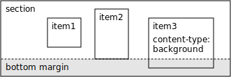

# Section Bottom Margin

section の下余白（bottom margin）とは、section のコンテンツの下位置と、section の下位置との間の距離である。

- [Example code](test_ssection_report_section_bottom_margin.rb)
- [Example template file](template.tlf)
- [Example PDF](expect.pdf)

要素の種類が `background` である item は、下余白には影響しない。

上図の例の場合、item3 は要素の種類が `background` なので、下余白には影響しない。
item1 の下端よりも item2 の下位置の方が下にあるため、item2 の下位置と section の下位置の間の距離が、この section の下余白となる。

section の自動伸縮が有効のときは、section の下余白を保った状態で section が自動的に伸縮する。詳細は [Section Auto Stretch](../section_report_section_auto_stretch/README.md) を参照
